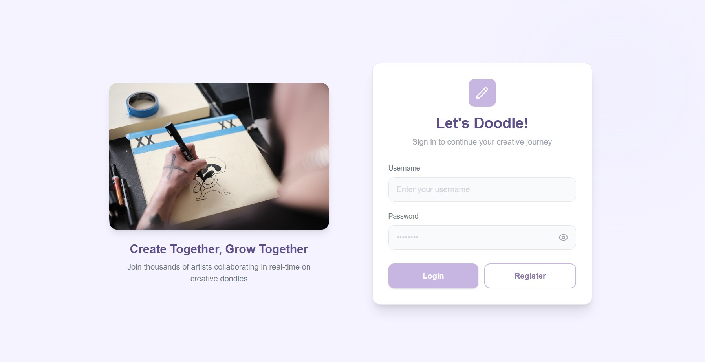

# Writeboard

Writeboard is a high-performance, real-time collaborative drawing application. It allows multiple users to jump onto a shared canvas, sketch ideas, and brainstorm together with zero lag and persistent storage.

---

### UI Preview


*The modern, secure gateway to your collaborative creative journey.*

---

### Key Features

* **Real-Time Collaboration:** Powered by WebSockets for instant stroke synchronization across all connected users.
* **Persistent Rooms:** Every board has a unique roomId. Sketches are saved to MongoDB, so your work is there when you return.
* **Secure Workspaces:** JWT-based authentication ensures users can manage and delete their own boards securely.
* **Buffered Sync:** Optimized backend logic that batches drawing coordinates before saving to the database to ensure smooth performance.
* **Clean UI/UX:** A minimalist interface designed in Figma to keep the focus on creativity and collaboration.

---

### Tech Stack

| Layer | Technology |
| :--- | :--- |
| **Frontend** | React, Vite, HTML5 Canvas API, CSS3 |
| **Backend** | Node.js, Express.js |
| **Database** | MongoDB (Mongoose) |
| **Real-time** | Socket.io |
| **Security** | JSON Web Tokens (JWT), Bcrypt |
| **Design** | Figma |

---

### System Architecture

Writeboard is designed to handle high-frequency data without compromising database performance:

1.  **Authentication:** Users authenticate via the Auth API. The JWT is stored client-side to maintain the session.
2.  **Room Entry:** Upon entering a room, the client establishes a Socket.io connection and joins a specific roomId.
3.  **The Sync:** When a user draws, coordinates are emitted to the server and broadcasted to everyone else in the room in real-time.
4.  **Optimized Storage:** To prevent database bottlenecks, Writeboard uses a server-side buffer. Strokes are collected and pushed to MongoDB in batches using the $each operator.

---

### Installation and Setup

1.  **Clone the Repository**
    ```bash
    git clone [https://github.com/PhalakTaneja/WriteBoard.git](https://github.com/PhalakTaneja/WriteBoard.git)
    cd WriteBoard
    ```

2.  **Environment Variables**
    Create a .env file in the root directory:
    ```env
    PORT=8080
    MONGO_URI=your_mongodb_connection_string
    JWT_SECRET=your_super_secret_key
    ```

3.  **Install Dependencies**
    ```bash
    # Install backend dependencies
    npm install

    # Install frontend dependencies
    cd client
    npm install
    ```

4.  **Run the Application**
    ```bash
    # Start backend (from root)
    npm run dev

    # Start frontend (from /client)
    npm run dev
    ```

---

### Future Roadmap

* **Export to Image:** Save brainstorm sessions as PNG or SVG files.
* **Undo/Redo:** Full stroke-by-stroke history management.
* **Live Cursors:** Real-time visibility of active users' cursor positions on the canvas.


---
